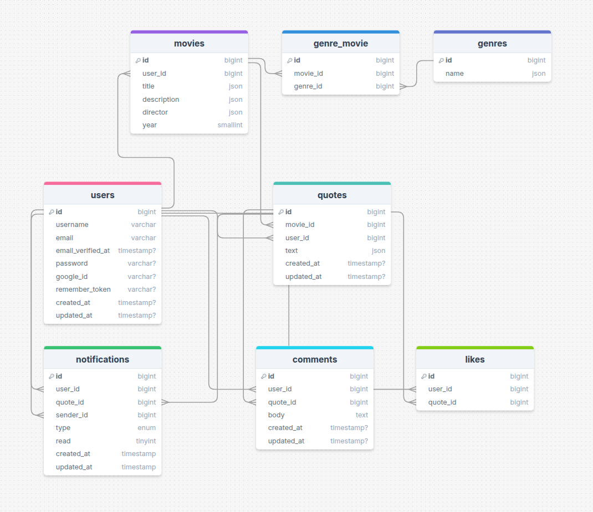

# Movie Quotes Backend

**Movie Quotes Backend** is the API and real-time engine for the Movie Quotes platform, handling user authentication, quote and movie management, profile customization, and real-time notifications. Built with Laravel, it powers all core features.

## Table of Contents

-   [Prerequisites](#prerequisites)
-   [Tech Stack](#tech-stack)
-   [Getting Started](#getting-started)
-   [Migration](#migration)
-   [Database Seeding](#database-seeding)
-   [Development](#development)
-   [Resources](#resources)

## Prerequisites

-    *PHP@8.3.x and up*
-    *MYSQL@8.x and up*
-    *NPM@11.x and up*
-    *Composer@2.8.x and up*

## Tech Stack

-    [Laravel@12.x](https://laravel.com/docs/12.x/ "Laravel") — PHP framework
-    [Laravel Sanctum](https://laravel.com/docs/12.x/sanctum) — Simplified API authentication for SPA and mobile apps
-    [Laravel Socialite](https://laravel.com/docs/12.x/socialite) — OAuth authentication for social login
-    [Spatie Query Builder](https://spatie.be/docs/laravel-query-builder/v6/introduction) — Build complex, filterable API queries
-    [Spatie Laravel Media Library](https://spatie.be/docs/laravel-medialibrary/v11/introduction) — Associate files with Eloquent models
-    [Pusher](https://pusher.com/docs/channels) — Real-time notifications and events
-    [Pest](https://pestphp.com/docs/introduction) — Elegant PHP Testing Framework

## Getting Started

#### 1. Clone the Repository

```
git clone https://github.com/RedberryInternship/movie-quotes-back-nika-peikrishvili.git
```

#### 2. Navigate to the Project Folder

```
cd movie-quotes-back-nika-peikrishvili
```

#### 3. Install PHP Dependencies

```sh
composer install
```

#### 4. Install JS Dependencies

```bash
npm install
```

#### 5. Set Up Environment Variables

You’ll need to configure the environment variables by copying the provided `.env.example` file:

```sh
cp .env.example .env
```

#### 6. Configure `.env` file:

##### **Database:**

```sh
DB_CONNECTION=mysql
DB_HOST=127.0.0.1
DB_PORT=3306
DB_DATABASE=
DB_USERNAME=
DB_PASSWORD=
```

> **Note:** Set these values according to your local or remote MySQL database setup.

##### **Mail Configuration:**

```sh
MAIL_MAILER=smtp
MAIL_HOST=sandbox.smtp.mailtrap.io # or another mail service
MAIL_PORT=2525
MAIL_USERNAME=
MAIL_PASSWORD=
MAIL_FROM_ADDRESS=
MAIL_FROM_NAME=
```

> **Note:** You may replace `MAIL_HOST`, `MAIL_USERNAME`, and `MAIL_PASSWORD` with your own credentials from your preferred mail testing tool.

##### **Google OAuth Configuration:**

```sh
GOOGLE_CLIENT_ID=
GOOGLE_CLIENT_SECRET=
GOOGLE_REDIRECT_URI=
```

> **Note:** Obtain these credentials from your Google Cloud Console.

##### **Pusher Configuration:**

```sh
PUSHER_APP_ID=
PUSHER_APP_KEY=
PUSHER_APP_SECRET=
PUSHER_APP_CLUSTER=
PUSHER_PORT=
PUSHER_SCHEME=
```

> **Note:** Get these values from your Pusher dashboard.

##### **Other Important Environment Variables:**

Make sure to set the following based on your setup:

```sh
APP_URL=http://localhost:8000
FRONTEND_URL=http://localhost:3000
SANCTUM_STATEFUL_DOMAINS=localhost:3000
```

#### 7. Cache Environment Variables

After setting up your `.env` file, run the following command to cache the environment variables:

```sh
php artisan config:cache
```

#### 8. Generate Application Key

Generate the application key used by Laravel for encryption and session management

```sh
php artisan key:generate
```

#### 9. Set Up Storage Link

Laravel stores uploaded files in a protected directory. To make these files accessible via the browser, run the following:

```sh
php artisan storage:link
```

## Migration

If you've completed [Getting Started](#getting-started) section, then migrating database is fairly simple process, just execute:

```sh
php artisan migrate
```

## Database Seeding

If you'd like to populate the database, you can do so by executing:

```sh
php artisan db:seed
```

## Development

You can run Laravel’s built-in development server by executing:

```sh
php artisan serve
```

## Resources

> ⚙️ [Frontend Repository](https://github.com/RedberryInternship/movie-quotes-front-nika-peikrishvili)  
> 📊 [Database Diagram](https://drawsql.app/teams/rb-24/diagrams/movie-quotes)


